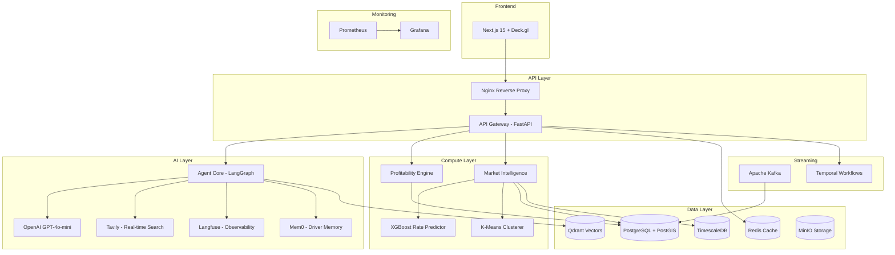

<div align="center">

# 🚛 DeadMile AI

### Intelligent Load Optimization Agent for Trucking

**Stop losing money on empty miles. Maximize NET profit, not gross revenue.**

[](https://buildathon.dev)
[](https://python.org)
[](https://nextjs.org)
[](https://langchain-ai.github.io/langgraph/)
[](https://docker.com)


[Live Demo](#demo) · [Architecture](#architecture) · [Quick Start](#quick-start) · [Tech Stack](#tech-stack)

</div>

---

## 🎯 The Problem

95% of US trucking companies run fewer than 10 trucks with razor-thin 3-6% margins. The biggest controllable cost is the **empty mile** — 15-20% of all truck miles earn nothing. Drivers pick loads based on gross rate, not net profitability, losing **$15,000-30,000 per truck per year**.

A load paying $3,000 that drops a truck in a dead market (no outbound loads) is **worse** than a $2,200 load to a hot market with plenty of freight.

## 💡 The Solution

DeadMile AI is an **AI agent** that recommends the most profitable loads by calculating **TRUE net profit** — revenue minus fuel, driver pay, insurance, maintenance, tolls, dispatch fees, and critically, **deadhead costs in both directions**.

### Key Differentiators

- **Net profit, not gross rate** — full P&L for every load recommendation
- **Paste & analyze** — import loads from any load board (text, CSV, screenshot) at `/import`
- **Load Showdown** — public compare tool at `/compare` (shareable, no login)
- **100% free** — no subscription, no usage limits
- **Destination market scoring** — knows which cities have freight and which are dead ends
- **Multi-hop load chaining** — optimizes 3-5 load sequences for maximum weekly earnings
- **Fleet cost profiles** — your fuel, MPG, and driver pay personalize every calculation
- **Google / email login** — NextAuth with onboarding and per-driver profiles
- **PWA** — install on mobile from the browser

## 🏗️ Architecture



**19 Docker Containers:**

| Category | Services |
|----------|----------|
| **Application** | API Gateway, Agent Core, Load Ingestion, Load Processor, Profitability Engine, Market Intelligence, Frontend |
| **Data** | PostgreSQL + PostGIS, Redis, Qdrant, MinIO |
| **Streaming** | Kafka, Zookeeper, Kafka UI |
| **Orchestration** | Temporal, Temporal UI |
| **Infrastructure** | Nginx, Prometheus, Grafana |

## 🚀 Quick Start

### Prerequisites

- Docker & Docker Compose
- API Keys: [OpenAI](https://platform.openai.com), [Mapbox](https://mapbox.com) or [MapTiler](https://maptiler.com) (optional: Tavily, Langfuse)

### Setup

```bash
# Clone
git clone https://github.com/Nithishkaranam2002/DeadMile-AI-.git
cd DeadMile-AI-

# Configure
cp .env.example .env
# Edit .env — add OPENAI_API_KEY and NEXT_PUBLIC_MAPBOX_TOKEN (or MAPTILER_KEY)

# Validate environment
python scripts/validate_env.py

# Launch everything (19 containers)
make setup

# This runs: docker compose --profile full up → seed data → train models → seed vectors
# Takes ~3 minutes on first run
```

### Load Data

Synthetic load files are **not committed** (large hackathon dataset). Download from the hackathon Google Drive and place in:

```
data/text/   # loads_part_000.txt – loads_part_012.txt (13 files)
data/pdf/    # broker_load_sheet_001.pdf – 012.pdf (12 files)
```

Then run `make seed` to ingest ~2,500+ loads.

### Access

| Service | URL |
|---------|-----|
| **Dashboard** | http://localhost:3000 |
| **API Docs** | http://localhost:8000/docs |
| **Grafana** | http://localhost:3001 (admin / see `.env`) |
| **Temporal UI** | http://localhost:8080 |
| **Kafka UI** | http://localhost:8090 |

### Dev Modes

```bash
make dev    # Light stack (~8 containers) — core services only
make demo   # Full stack (19 containers) — for demos and judging
```

See **[PRODUCTION.md](./PRODUCTION.md)** for deploying as a real fleet product (carrier profiles, API keys, production mode).

## 🎬 Demo

See **[DEMO.md](./DEMO.md)** for the complete 5-minute demo script with talking points, Q&A prep, and step-by-step walkthrough.

## 🛠️ Tech Stack

### AI & ML

| Tech | Purpose |
|------|---------|
| LangGraph | Multi-step ReAct agent with 8 tools |
| LiteLLM | Unified LLM interface with fallback |
| OpenAI GPT-4o-mini | Primary LLM inference (Groq/Featherless/Ollama via LiteLLM) |
| Tavily | Real-time fuel prices & market data (hackathon sponsor) |
| Langfuse | LLM observability & tracing |
| Mem0 | Persistent driver preference memory |
| XGBoost | Lane rate prediction model |
| scikit-learn | K-Means market clustering |
| Sentence Transformers | Load commodity embeddings |
| Qdrant | Semantic vector search |

### Backend

| Tech | Purpose |
|------|---------|
| FastAPI + Pydantic v2 | API gateway & microservices |
| PostgreSQL + PostGIS | Geospatial load database |
| TimescaleDB | Time-series rate history |
| Apache Kafka | Real-time load ingestion pipeline |
| Temporal | Durable workflow orchestration for load chains |
| Redis | Caching layer |
| MinIO | Document storage |

### Frontend

| Tech | Purpose |
|------|---------|
| Next.js 15 | React framework with App Router |
| Deck.gl | GPU-accelerated map visualizations |
| Mapbox GL | Base map tiles |
| Tremor + Recharts | Dashboard charts |
| Framer Motion | Animations |
| Zustand | State management |
| shadcn/ui | UI component library |
| Web Speech API | Voice input |

### Infrastructure

| Tech | Purpose |
|------|---------|
| Docker Compose | 19-container orchestration |
| Nginx | Reverse proxy + SSE support |
| Prometheus | Metrics collection |
| Grafana | Monitoring dashboards |

## 🤖 Agent Tools

The LangGraph agent has 8 specialized tools:

| # | Tool | Purpose |
|---|------|---------|
| 1 | `search_loads` | PostGIS spatial search for nearby loads |
| 2 | `calculate_profitability` | Full net P&L with all cost components |
| 3 | `get_market_score` | Destination market quality (Hot→Dead) |
| 4 | `predict_lane_rate` | XGBoost rate trend forecasting |
| 5 | `find_load_chain` | Multi-hop route optimization (Temporal) |
| 6 | `get_fuel_prices` | Tavily real-time diesel prices |
| 7 | `semantic_load_search` | Qdrant vector search on commodities |
| 8 | `get_driver_preferences` | Mem0 personalization memory |

## 📊 Features

### Smart Load Recommendation

Full P&L breakdown for every load: revenue - fuel - driver pay - insurance - maintenance - tolls - fees - deadhead = **NET PROFIT**

### Destination Market Intelligence

Every US city scored 0-100 based on outbound load density, rates, and lane balance. The agent won't recommend a high-paying load to a dead market.

### Multi-Hop Load Chaining

Optimizes sequences of 2-5 loads for maximum weekly earnings. Uses beam search with Temporal workflows.

### Rate Prediction

XGBoost model predicts whether rates on a lane are rising, stable, or falling.

### What-If Simulator

Drag a pin anywhere on the US map — instantly see available loads, projected earnings, and market quality.

### Voice Input

"I'm in Houston with a reefer" — speak your query, get results.

## 🏆 Buildathon 2026 — Statement 6

This project addresses **Statement 6: Trucking Load Optimization Agent** from Buildathon Dallas 2026.

**Sponsor integrations:** Tavily (real-time search). LLM via OpenAI GPT-4o-mini (swap providers via `LLM_MODEL` + `LLM_API_BASE`).

## 📄 License

MIT

---

<div align="center">
Built with 💚 for Buildathon 2026 by Nithish Karanam
</div>
