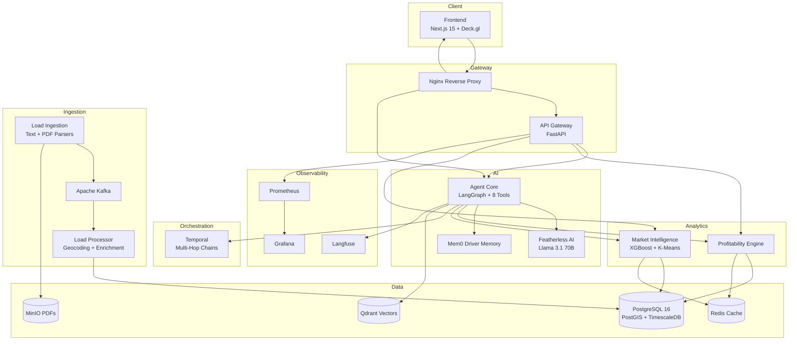

# DeadMile AI

**Intelligent Load Optimization for Small Trucking Carriers**

DeadMile AI is an enterprise-grade AI platform that helps small trucking carriers (3–10 trucks) maximize profitability by eliminating dead miles. An AI agent analyzes thousands of loads, calculates true net profitability, factors in destination market quality, and recommends optimal loads — including multi-hop chains that maximize weekly earnings.

[](https://www.python.org/)
[](https://fastapi.tiangolo.com/)
[](https://nextjs.org/)
[](https://langchain-ai.github.io/langgraph/)
[](https://docs.docker.com/compose/)

---

## The Problem

| Stat | Impact |
|------|--------|
| 95% of US trucking companies run fewer than 10 trucks | Thin margins (3–6%) leave no room for waste |
| 15–20% of all truck miles are empty (deadhead) | Zero revenue on every dead mile |
| Gross rate ≠ true profit | A high-paying load to a dead market costs more than a cheaper load to a busy hub |

DeadMile AI calculates **true net profitability**: revenue minus fuel, driver pay, insurance, maintenance, tolls, and deadhead miles in both directions.

---

## Architecture



### 19-Container Stack

| Layer | Containers |
|-------|-----------|
| **Data Stores** | PostgreSQL, Redis, Qdrant, MinIO |
| **Event Streaming** | Zookeeper, Kafka, Kafka UI |
| **Orchestration** | Temporal, Temporal UI |
| **Services** | API Gateway, Agent Core, Load Ingestion, Load Processor, Profitability Engine, Market Intelligence, Frontend |
| **Infrastructure** | Nginx, Prometheus, Grafana |

---

## Tech Stack

### Backend
- **Python 3.12** with FastAPI 0.115+ and Pydantic v2
- **LangGraph** agent orchestration with 8 specialized tools
- **LiteLLM** → Featherless AI (Llama 3.1 70B)
- **Apache Kafka** real-time load ingestion pipeline
- **Temporal** multi-hop load chain workflows

### Data
- **PostgreSQL 16** + PostGIS (geospatial) + TimescaleDB (rate time-series)
- **Qdrant** semantic load search
- **Redis** profitability and market score caching
- **MinIO** S3-compatible PDF storage

### ML
- **XGBoost** lane rate prediction with confidence intervals
- **scikit-learn K-Means** market clustering
- **Tavily** real-time fuel price lookup

### Frontend
- **Next.js 15** App Router + TypeScript 5
- **Tailwind CSS** + shadcn/ui
- **Deck.gl** + react-map-gl (3D hexagon heatmaps, animated arcs)
- **Tremor** dashboard charts, **Framer Motion** animations
- **Whisper.js** browser voice input, SSE agent streaming

---

## Quick Start

### Prerequisites

- Docker Desktop 4.25+ with Compose v2
- 16 GB RAM recommended (19 containers)
- API keys: [Featherless AI](https://featherless.ai), [Tavily](https://tavily.com), [Mapbox](https://mapbox.com) (optional for maps)

### Setup

```bash
# Clone and enter project
cd deadmile-ai

# Create environment file
cp .env.example .env
# Edit .env with your API keys

# Start everything
make dev
```

### Service URLs

| Service | URL |
|---------|-----|
| Frontend Dashboard | http://localhost:3000 |
| API Gateway | http://localhost:8000/docs |
| Agent Core (SSE) | http://localhost:8001 |
| Nginx (unified) | http://localhost |
| Grafana | http://localhost:3001 |
| Prometheus | http://localhost:9090 |
| Temporal UI | http://localhost:8080 |
| Kafka UI | http://localhost:8090 |
| MinIO Console | http://localhost:9001 |

### Seed Load Data

Place your load files in `data/text/` and `data/pdf/`, then:

```bash
make seed
```

---

## Makefile Commands

| Command | Description |
|---------|-------------|
| `make dev` | Build and start full stack |
| `make build` | Build all Docker images |
| `make up` | Start containers (detached) |
| `make down` | Stop all containers |
| `make seed` | Ingest load data from `data/` |
| `make logs` | Tail all service logs |
| `make logs-<service>` | Tail specific service logs |
| `make health` | Check service health endpoints |
| `make clean` | Remove containers and volumes |

---

## Agent Tools

The LangGraph agent has 8 tools for intelligent load optimization:

1. **search_loads** — PostGIS spatial query for nearby loads
2. **calculate_profitability** — Full net P&L with all cost components
3. **get_market_score** — Outbound density, avg rates, lane balance
4. **predict_lane_rate** — XGBoost forecast with confidence interval
5. **find_load_chain** — Temporal workflow for multi-hop optimization
6. **get_fuel_prices** — Tavily real-time diesel prices by state
7. **semantic_load_search** — Qdrant natural language load search
8. **get_driver_preferences** — Mem0 driver history and preferences

---

## Project Structure

```
deadmile-ai/
├── data/
│   ├── text/                 # loads_part_000.txt – loads_part_012.txt
│   └── pdf/                  # broker_load_sheet_001.pdf – broker_load_sheet_012.pdf
```

Place load files in `data/text/` and `data/pdf/` before running `make seed`.

---

## License

Proprietary — All rights reserved.
